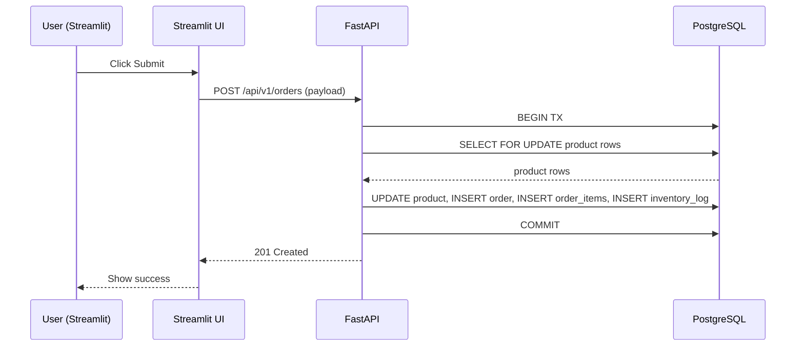

# Diagrams & export instructions

## System diagram (ASCII)

Frontend (Streamlit)  <--HTTPS-->  FastAPI Backend  <--SQLAlchemy-->  PostgreSQL
     |
     +--> Power Automate (webhooks)
     +--> Optional: LLM services (OpenAI)

## Mermaid example for create-order
Paste this at https://mermaid.live to export PNG/SVG:

